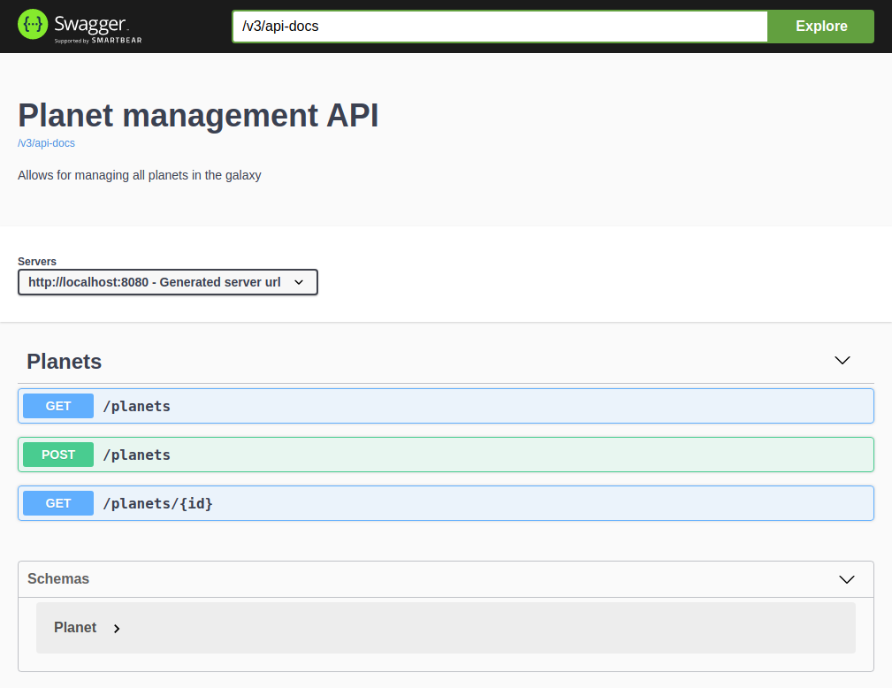

# OpenAPI client code generation example


This project is a sample REST service documented using Springdoc OpenAPI, 
with automatic Angular client code generation done using openapi-generator-maven-plugin.

To learn how to generate client code from Spring Boot using Maven, read the post:

[Code Soapbox - Generate client code From Spring Boot using Maven](https://code.danielfrak.com/generate-client-code-from-spring-boot-using-maven/)

## Getting Started

1. Clone the repository
```bash
$ git clone https://github.com/daniel-frak/openapi-client-code-generation.git
```

2. Build the application
```bash
$ mvn clean install
```

...or generate Angular code
```bash
$ mvn clean verify -P angular
```

## Built With

* Java 11
* [Spring Boot 2.2.2](https://start.spring.io/)
* [Maven](https://maven.apache.org/)
* [Springdoc OpenAPI](https://github.com/springdoc/springdoc-openapi/)
* [openapi-generator-maven-plugin](https://github.com/OpenAPITools/openapi-generator/tree/master/modules/openapi-generator-maven-plugin/)

## Screenshots


## License

This project is licensed under the MIT License - see the [license details](https://opensource.org/licenses/MIT).